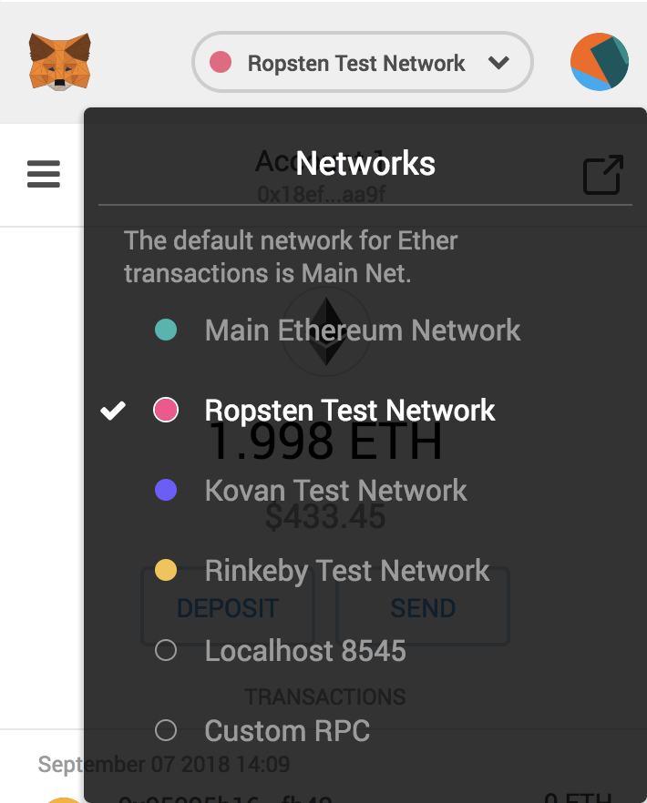

**Author:** Taggart Bowen-Gaddy
**Slides:** [PDF](public/web3-react_taggartbg.pdf)

## How To Use
1. Install depenendencies: `npm install`
1. Run Dev Server: `npm start`
1. Install MetaMask: [MetaMask.io](https://metamask.io/)
1. Connect to Ropsten TestNet:

## Want to use the naive approach?
1. Uncomment L9 in `App.js`
1. Refer to the documentation in `commands.js`

This project was bootstrapped with [Create React App](https://github.com/facebookincubator/create-react-app).